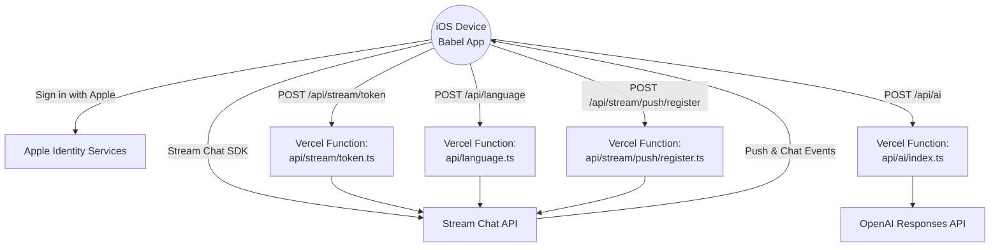

# Babel — AI-Powered Multilingual Chat (iOS)

Babel is a native SwiftUI client built with Stream Chat with Sign in with Apple, automatic language assistance, and production-ready push notifications. Phase 2 introduces AI-powered translation, tone rewrites, cultural explanations, and smart replies backed by OpenAI.

---

## Table of Contents
1. [Key Features](#key-features)
2. [Architecture Overview](#architecture-overview)
3. [Prerequisites](#prerequisites)
4. [Step-by-Step Setup](#step-by-step-setup)
5. [Push Notifications Checklist](#push-notifications-checklist)
6. [AI Features & Usage](#ai-features--usage)
7. [Project Structure](#project-structure)
8. [Troubleshooting & Tips](#troubleshooting--tips)

---

## Key Features
- **Native iOS app (SwiftUI + Stream Chat SDK)** with Sign in with Apple.
- **Automatic language assistance**: user chooses a preferred language, incoming messages translate inline with toggles.
- **AI toolkit powered by OpenAI**:
  - Context-aware smart replies.
  - Tone rewrite (formal/neutral/casual).
  - Instant message translation & explainers (slang/cultural hints).
- **Serverless backend on Vercel** for token exchange, push registration, language syncing, and AI calls.
- **Real push notifications** via Stream + APNs (foreground/background).
- **General channel auto onboarding**: every new user joins a shared `messaging:babel-general`.

---

## Architecture Overview



### Data Flow Highlights
- **Authentication**: iOS app exchanges Apple tokens with `/api/stream/token`, which verifies with Apple and creates a Stream token + user profile.
- **Language preferences**: stored locally (`LanguageSettings`) and synced to Stream via `/api/language`.
- **AI actions**: Composer/footer call `/api/ai` (translate, explain, tone, smart replies). Server proxies to OpenAI.
- **Push notifications**: device token sent to `/api/stream/push/register`, which registers the APNs token with Stream using the configured provider.

---

## Prerequisites
| Requirement | Purpose |
|-------------|---------|
| macOS with **Xcode 15.3+** | Build & run the SwiftUI app (iOS 16+ target). |
| **Apple Developer Account** | Configure Sign in with Apple and APNs certificates/keys. |
| **Stream Chat account** | Obtain API key/secret, configure push provider, monitor channels. |
| **Node.js 18+** & **npm** | Execute Vercel serverless functions locally and deploy. |
| **Vercel CLI** (`npm i -g vercel`) | Deploy `/api` functions and manage env vars. |
| **OpenAI API key** | Required for AI translation/tone/smart replies. |
| Physical iOS device (for push) | APNs requires real hardware; simulators won't receive pushes. |

---

## Step-by-Step Setup

### 1. Clone & Install Dependencies
```bash
git clone https://github.com/sm-heard/chat-app-ios-native.git
cd chat-app-ios-native
npm install         # sets up node_modules for Vercel functions
```

### 2. Configure Stream Chat
1. Create a Stream application (Development environment recommended).
2. Grab the **API Key** and **API Secret** — needed for Vercel env vars.
3. In the Stream dashboard:
   - Create (or verify) a push provider named **`chat-app-ios-native`** pointing to your APNs key.
   - Ensure the `messaging:babel-general` channel exists or let the token function create it on first run.

### 3. Configure Sign in with Apple
1. In Apple Developer Console create:
   - **Services ID / App ID** matching your bundle identifier (`com.smheard.chat-app-ios-native` by default).
   - **Sign in with Apple key** (download the `.p8`).
2. Note these values for Vercel env vars:
   - `APPLE_CLIENT_ID` or `APPLE_APP_ID`
   - `APPLE_TEAM_ID`
   - `APPLE_KEY_ID`
   - `APPLE_PRIVATE_KEY` (paste the `.p8` contents with `\n` escapes)

### 4. Configure Vercel Environment
Create a new Vercel project in this repo (or run `vercel link`). Add the following environment variables (Production + Preview):

| Variable | Description |
|----------|-------------|
| `STREAM_API_KEY` | Stream API key. |
| `STREAM_API_SECRET` | Stream API secret. |
| `STREAM_PUSH_PROVIDER_NAME` | (Optional) Overrides default push provider name (`chat-app-ios-native`). |
| `APPLE_CLIENT_ID` or `APPLE_APP_ID` | Audience for Sign in with Apple validation. |
| `APPLE_TEAM_ID` | Team identifier from Apple Developer portal. |
| `APPLE_KEY_ID` | Key identifier for the Sign in with Apple key. |
| `APPLE_PRIVATE_KEY` | Contents of the `.p8` key (replace line breaks with `\n`). |
| `OPENAI_API_KEY` | OpenAI API key used for AI features. |
| `OPENAI_MODEL` | (Optional) Defaults to `gpt-4o-mini`; override if needed. |

For local testing with `vercel dev`, create a `.env` file containing the same keys.

### 5. Deploy the Serverless Backend
```bash
vercel deploy --prod
```
Record the deployed URL (e.g. `https://chat-app-ios-native-token.vercel.app`). The iOS app will call this for tokens/AI.

### 6. Update iOS App Configuration
Open `Babel/Info.plist` and replace placeholders:
| Key | Example | Notes |
|-----|---------|-------|
| `STREAM_API_KEY` | `yxfd7mnyreft` | Use your Stream API key. |
| `TOKEN_ENDPOINT` | `https://<your-vercel-app>.vercel.app/api/stream/token` | Must point to the deployed token function. |
| `PUSH_PROVIDER_NAME` | `chat-app-ios-native` | Must match the provider configured in Stream. |
| `NSPhotoLibraryUsageDescription`, `NSCameraUsageDescription` | Already present; edit copy if desired. |

You can also override these via Xcode build settings or environment variables when running locally—`AppConfig` picks up runtime env first.

### 7. Run the iOS App
1. Open `Babel.xcodeproj` in Xcode 15+.
2. Select the **Babel** scheme and a signing team.
3. Run on a physical device for push/SIWApple (simulator works for basic chat only).
4. On first launch:
   - Sign in with Apple.
   - Choose a preferred language (defaults to device language).
   - Allow push notifications and photo access when prompted.

---

## Push Notifications Checklist
1. **APNs Key**: Upload to Stream dashboard and associate with provider `chat-app-ios-native`.
2. **Capabilities**: `Babel/Babel.entitlements` already enables `aps-environment=development`; switch to `production` for App Store/TestFlight.
3. **Server**: Ensure `STREAM_API_KEY/SECRET` and `STREAM_PUSH_PROVIDER_NAME` are set in Vercel.
4. **Device**: Run on physical hardware, accept notification permission, send/receive messages to trigger Stream push.

---

## AI Features & Usage
Feature | Trigger | Backend Path | Notes
------- | ------- | ------------ | -----
Smart Replies | Tap **Suggestions** above the composer | `POST /api/ai` `{task: "smart_replies"}` | Returns up to 3 context-aware replies in preferred language.
Tone Rewrite | Switch tone pill (Formal/Neutral/Casual) | `POST /api/ai` `{task: "tone"}` | Rewrites current draft; neutral resets to original.
Translate & Send | Tap **Translate to …** button | `POST /api/ai` `{task: "translate"}` | Replaces composer text with translation for other participant.
Explain | Tap **Explain** under a message | `POST /api/ai` `{task: "explain"}` | Provides concise cultural/slang notes.
Inline Translation | Automatic | `TranslationCoordinator` + `POST /api/ai` | Caches translations for 2 hours per message.

All AI traffic flows through the Vercel function to OpenAI’s Responses API; no keys are embedded in the client.

---

## Project Structure
```
├─ Babel/                 # SwiftUI app
│  ├─ AI/                 # AI client wrappers & language detection
│  ├─ Config/             # AppConfig + Stream UI customization
│  ├─ Networking/         # Token, push, language services
│  ├─ Services/           # Keychain, push manager, language settings
│  └─ Views/              # Chat composer, translation footer, profile, etc.
├─ api/                   # Vercel serverless functions
│  ├─ ai/index.ts         # OpenAI proxy for translate/explain/tone/smart replies
│  ├─ language.ts         # Persists preferred language on Stream user
│  └─ stream/
│     ├─ token.ts         # Sign in with Apple verification + Stream token issuance
│     └─ push/register.ts # Registers APNs token with Stream push provider
├─ docs/phase2/           # PRD, implementation plan, status docs
└─ MessageAI.md           # Hackathon brief / background
```

---

## Troubleshooting & Tips
- **Infinite loading / crash at launch**: make sure `STREAM_API_KEY` and `TOKEN_ENDPOINT` are set correctly (AppConfig will `fatalError` otherwise).
- **Sign in with Apple errors**: double-check Vercel env matches your Services ID and that the bundle identifier equals the Apple App ID.
- **Generic smart replies**: after the recent prompt tuning, redeploy the `api/ai` function (`vercel deploy`) to pick up the change.
- **Push notifications not arriving**: Stream dashboard > Push > Test push to verify provider; ensure the device token is registered (check Vercel logs for `/api/stream/push/register` calls).
- **AI latency**: OpenAI timeouts default to ~10s. For long responses consider trimming message history or upgrading the plan.
- **Language selection**: existing users who skip the initial sheet can change their preferred language from the Profile tab; the app re-syncs with `/api/language`.

Happy building! Ping the team if you need deeper documentation on extending AI features or rolling out to production. 🎉
